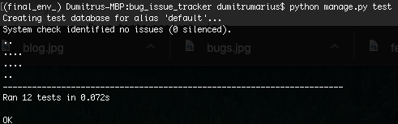

   

  

### [Live preview of the project here](https://ci-final-project.herokuapp.com/)

The goal of this project was to create a Fullstack Web Aplication using Django Framework.  
The ideea of Bug Issue Tracker has been choosen from the assessment brief.  
The purpose of the project is to allow users to submit their Bugs and Features requests.  
Bugs are free of charge and the solution for every bug will be posted public as a comment to that specific bug requested, but Features have a development cost of £10 and every developed Feature will be sent to the user by email when payment has beem received.
   
## UX  

#### User Stories   
 * As a user, I would like to be able to read Bugs and Features posts
 * As a user, I would like to be able to create an account and log in to the web site to:   
 	* submit a Bug or Feature fix request
 	* comment on a Bug or Feature post
 	* add items to cart 
 	* pay securely
 	* edit a Bug or Feature previously submited
 	* delete a Bug or Feature previously submited
 	* edit a comment previously submited
 	* delete a comment previously submited
 * As a user, I would like to be able to reset my password
 * As a user, I would like to see statistics so that I can have an ideea about how the site is doing  
 * As a user, I would like to be able to read Blog posts
 
## Features  

#### Implemented  

**Register** - allow users to register an account  
**Log In** - allow users to sign in their accounts  
**Reset Password** - allow users to reset passwords if needed  
**Submit Bug request** - allow users to submit Bug requests  
**Submit Feature request** - allow users to submit Feature requests  
**Comments**- allow users to comment on a Bug, Feature or Blog post  
**Edit** - allow users to edit a previously submited Bug, Feature or Comment  
**Delete** - allow users to delete a previously submited Bug, Feature or Comment   
**Payment** - allow users to pay securely using Stripe payments  
**Statistics** - allow users to see how many requests have been done, received or in progress 

#### Left To Implement   

**Order history in user account** - currently orders can be seen only by admin  
**Save card details** - this will allow users to pay quicly  
**PayPal and ApplePay** - this will allow users to choose from flexible payment options  

## Technologies Used  

* **Sublime Text** - this IDE was used to write the project
* **HTML** 
* **CSS** - was used for styles, colors
* **JavaScript** - used for some elements on the front end of the project
* **jQuery** - used for some elements on the front end of the project  
* **Bootstrap** - was used for layout and responsiveness
* **Python** - used as main language for server-side of the project
* **Django** - python framework used for server-side 
* **Stripe** - used to process payments 
* **Chart.js** - used for statistics
* **MySQL** - Postgres/Sqlite3 - used for relational databeses 
* **AWS S3 Bucket** - used to store static files 
* **Travis CI** - used for coutinuos testing  
* **Heroku** - used for deployement  

## Testing  

This project was tested across diifferent browsers and devices.  
The code has been checked with PEP8 checker and validator.w3.  
Most often the warnings came from **tab indentation** which is expected as the IDE was setted to use TAB for indentation and the HTML validator did not recognized Django tags.

#### Devices and Browsers  

|Browser | Version | Compatibility |  
|:--------:|:---------:|:------------: |  
|Google Chrome | Latest | 100% |  
|Mozilla Forefox | Latest | 100% | 
|Safari | Latest | 100% | 

|Device | Version | Compatibility |  
|:--------:|:---------:|:------------: |  
|Samsung | S9, S10 Plus | 100% |  
|Iphone | XS MAX, 11 PRO | 100% | 

#### Automated testing  

Tests were written in `tests.py` on every app and they pass.  

  

#### Manual testing   

Manual testing has been done to maake sure everything works as expected.  

1. Accounts  
	1.1 Create an user account:  
    * click on `register` - this will load the registration page.  
    * try to submit an empty form - this will raise some warnings to fill in all fields.   
    * try to submit with two different passwords - this will raise an error, the password should match.       
    *  fill in all details correctly and submit - this will create the user and redirect to `HOME` page and will display a feedback message to let the user know that the account has been created. 
    *  when user created, click on `Log Out` - this will log out the user and redirect to `Log Out` page, then click on `Log In`, fill in the username and password and click `Log In` - this will log the user in and redirect to `HOME` page.  
     
    1.2 Password Reset:  
    * go to log in page, click on the `Forgot Password` button - this will go to reset password page  
    * on the reset password page - enter email address and click `reset password` - this will redirect to feedback page and user will receive an email with instructions for reseting the password.  
    
2. Bugs  
    2.1 Create a Bug request:  
	* once logged in , click on `Bugs`, on the navbar - this will go to `Bugs` page  
	* click on the `Request a bug` button - this will go to bug request page.   
	* fill in all details required and press `Submit` - this will create the bug request and redirect to that bug detail page.   
	
	2.2 Edit Bugs:  
	 * go to a previously submited bug and click on the edit icon - his will open the `edit bug` page 
	 * fill in all new details and press submit - this will save the new details and redirect to that bug detail page   
	 > Note: only the author of that bug post can edit it 
	
	2.3 Delete Bugs:  
	 *  go to a previously submited bug and click on the delete icon - this will open a pop-up modal for confirmation - click yes and it will delete that bug post and redirect to `bugs` page. 
	 > Note: only the author of that bug post can delete it  

3. Features  
	3.1 Create a Feature request:  
	* once logged in , click on `Features`, on the navbar - this will go to `Features` page  
	* click on the `Request a Feature` button - this will go to Feature request page.   
	* fill in all details required and press `Submit` - this will create the Feature request and redirect to that Feature detail page.   
	
	3.2 Edit Features:  
	 * go to a previously submited Feature and click on the edit icon - his will open the `edit feature` page 
	 * fill in all new details and press submit - this will save the new details and redirect to that feature detail page   
	 > Note: only the author of that feature post can edit it 
	
	3.3 Delete Features:  
	 *  go to a previously submited Feature and click on the delete icon - this will open a pop-up modal for confirmation - click yes and it will delete that Feature post and redirect to `Feature` page. 
	 > Note: only the author of that Feature post can delete it   

4. Comments  
     > Note: comments works on the same way for Bugs, Features and Blog posts   
     > Note 2: comments have to be aproved by the admin, and are displayed only for logged in users.  
	* once loged in, go to any post, fill in the required fields and press `submit` - the user will receive a feedback message, and the comment will be sent for moderation.  

5. Cart   
	5.1 Add to cart  
	* to add a feature to cart, click on the `Add to cart` button - this will redirect to cart page
	5.2 Remove from cart  
	* to remove from cart, click on the `Remove from cart ` button - this will remove the item and redirect to the updated cart page  

6. Checkout  
	6.1 Paying for an item  
	* to pay for an item click on the `Checkout` button - this will go to the checkout page  
	* fill in all details and click on the `Pay` button - this will check the details and redirect `Features` page, and will display a feedback message for the user    
	> Note: if the payment fails it will redirect back to ckeckout  

##### Main Errors Encountered 
1. Token 
	* During integration of Stripe for payments the main error faced was token not being generated - solved by implementing version 3 of Stripe.   

2. Like button  
	* the like button created for `Bugs` can be clicked as many times as the user want, instead of just once. However, it has not been fixed yet due to time left to submit this project.  
	
3. Password reset  
	* when user requested a password reset an error showed up and fails to send the password reset email to the user - solved by changing the security settings on google account.  

4. Deployment  
	* the deployment failed on collecting the static files and worked only with `DISABLE_COLLECTSTATIC=1`. I manage to overcome this by using `BOTO3` package.  
	
## Deployment 

For this project I used Sublime Text as text editor, git version control, GitHub to host the code versions and Heroku for deployment.

###### Deploying to Heroku  

* set all secret keys to environment variables to an env.py file and added to `.gitignore`  
* created `requirements.txt` file
* created `Procfile`
* created a Heroku app, linked it with the github repository and enabled automatic deployment   
* set up Postgres Hobby Dev database on heroku  
* I connected to Heroku from terminal using `heroku login` command  
* set up the environment variables on heroku using `heroku config:set <VAR_NAME>="<VAR_VALUE>"`  
* added Heroku url to allowed hosts  
* pushed code using `git push -u origin master`  
* after deploying run commands `heroku run python manage.py migrate` to create the database models and `heroku run python manage.py createsuperuser` to create an admin user  

###### Local Deployment  

To deploy this project locally: 

* Clone or Download the GitHub repository  
* Create a virtual environment and activate it    
* Install the packages from requirements using `pip install -r requirements.txt` command
* Set environment variables  
* Run migrations to create databese models using `python manage.py makemigrations` then `python manage.py migrate`
* Create a super user using `python manage.py createsuperuser` command
* Run the server with `python manage.py runserver` command  

## Credits  

During this projects' development I have followed many tutorials for clarifications as well as to learn new functionalities and parts of code may come from:

* [Django Central](https://djangocentral.com/)  - website
* [Corey Schafer](https://www.youtube.com/user/schafer5/videos) - on youtube
* [JustDjango](https://www.youtube.com/watch?v=Xjty8q524Jo&t=912s) - on youtube
* [Pixabay](https://pixabay.com/) - website

